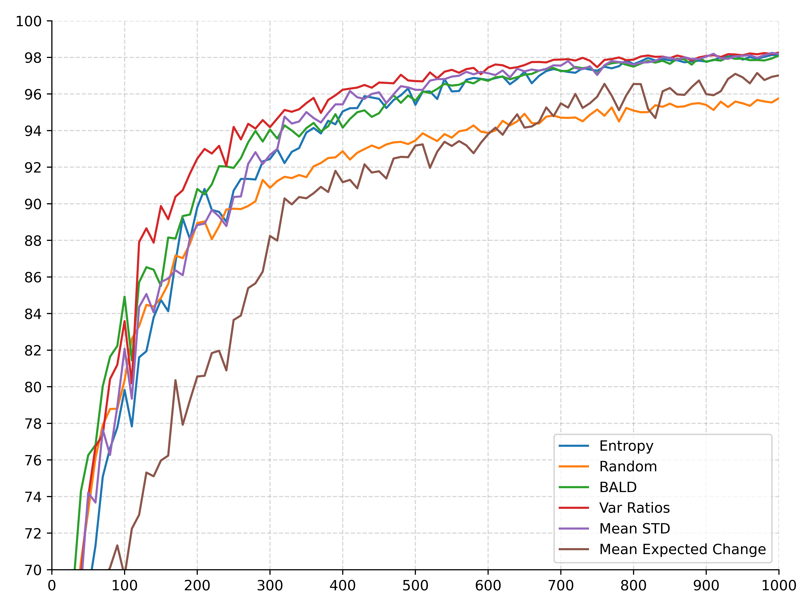
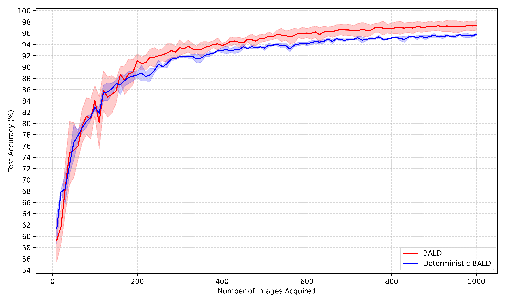
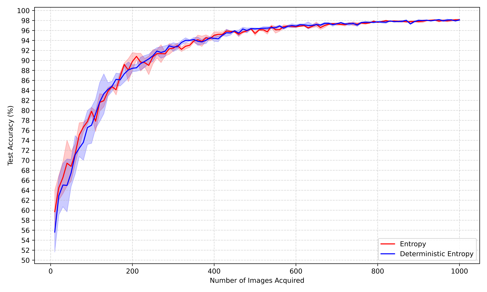
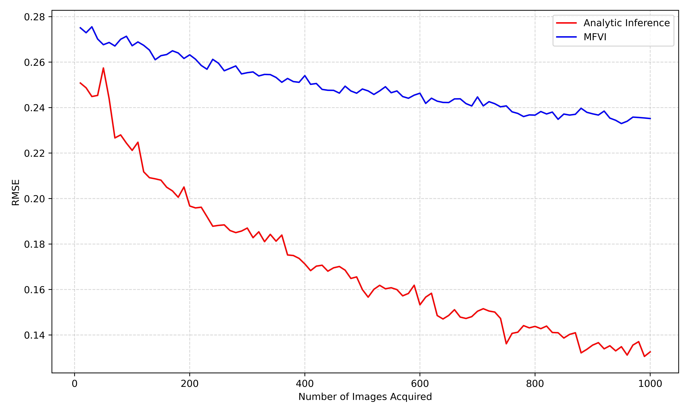
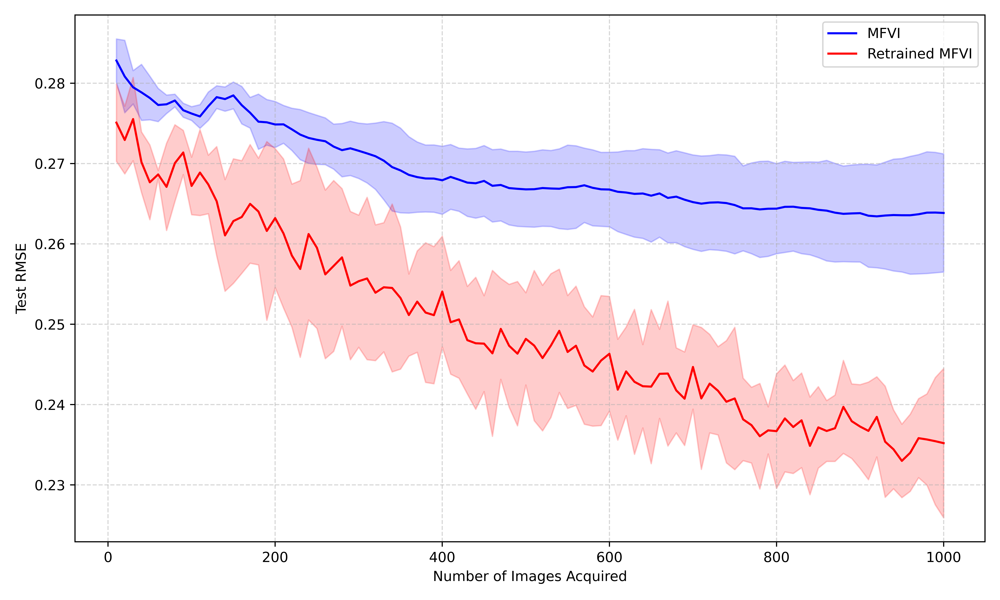

# Deep Active Learning with Bayesian CNNs

A reproduction and extension of **Deep Bayesian Active Learning with Image Data** (Gal, Islam & Ghahramani, 2017), produced for the Oxford *Uncertainty in Deep Learning* mini-project.

The project reproduces the core MNIST active-learning results of the paper, extends the framework from classification to **regression with analytic Bayesian inference and mean-field variational inference (MFVI)**, and introduces **two novel acquisition functions**: a modified variation-ratio score and an expected-model-change (EMC) score.

<p align="center">
  
</p>
<p align="center"><i>MNIST test accuracy as a function of the number of acquired images. Non-random acquisition functions reach ~98% accuracy far faster than random sampling.</i></p>

---

## Table of Contents

- [Motivation](#motivation)
- [What This Project Does](#what-this-project-does)
- [Acquisition Functions](#acquisition-functions)
- [Repository Structure](#repository-structure)
- [Installation](#installation)
- [Quick Start](#quick-start)
- [Running the Experiments](#running-the-experiments)
- [Configuration](#configuration)
- [Results](#results)
- [Method Summary](#method-summary)
- [References](#references)

---

## Motivation

Modern deep learning requires large labelled datasets, but in domains such as medical imaging or autonomous driving, labelling is expensive. **Deep active learning (DAL)** addresses this by letting the model itself choose which unlabelled points are most worth labelling. Starting from a tiny labelled seed set, the model repeatedly:

1. scores every point in the unlabelled pool with an **acquisition function**,
2. requests labels for the highest-scoring points,
3. retrains, and repeats.

A good acquisition function reaches high accuracy with far fewer labels than random sampling. This project studies several such functions for both classification and regression, and proposes two new ones.

---

## What This Project Does

| Component | Description |
|-----------|-------------|
| **Paper reproduction** | Reproduces Section 5.1/5.2 of Gal et al. (2017): compares Entropy, BALD, Variation Ratios, Mean STD and Random acquisition on MNIST with a Bayesian (MC-dropout) CNN. |
| **MC vs. deterministic** | Compares MC-dropout acquisition (`T` stochastic forward passes) against deterministic single-pass acquisition (`T=1`, dropout off). |
| **Minimal extension — regression** | Trains a CNN feature extractor, freezes it, and performs Bayesian linear regression on one-hot MNIST targets via (a) **analytic inference** (closed-form Gaussian posterior) and (b) **MFVI** (optimising the negative ELBO). Predictive variance is used as the acquisition score. |
| **Retraining ablation** | Compares freezing the feature extractor against retraining it after each acquisition step. |
| **Novel extension** | Adds a **modified variation-ratio** function (well-behaved in the deterministic limit) and an **expected-model-change (EMC)** function based on final-layer gradient norms. |

All experiments use **MNIST**, an initial balanced training set of **20 images**, acquire **10 images per step** for **100 steps**, and average over **3 runs**.

---

## Acquisition Functions

Implemented in [`acquisition_functions.py`](acquisition_functions.py). Each classification function takes MC predictions of shape `T × N × C` (passes × pool size × classes):

| Function | Code | Idea |
|----------|------|------|
| **Max Entropy** | `calc_entropy` | Entropy of the mean predictive distribution. |
| **BALD** | `calc_BALD` | Mutual information between predictions and model weights. |
| **Variation Ratios** | `calc_var_rat` | Fraction of passes disagreeing with the modal class. |
| **Mean STD** | `calc_Mean_STD` | Mean per-class standard deviation across passes (epistemic uncertainty). |
| **Random** | `calc_uniform` | Uniform baseline. |
| **Modified Variation Ratios** *(novel)* | `calc_var_rat_mod` | `1 − max_c (mean softmax)` — uses soft probabilities so it does **not** degenerate to random sampling when `T=1`. |
| **Expected Model Change (EMC)** *(novel)* | `mean_change` | Expected norm of the final-layer loss gradient, weighted by predicted class probabilities. Larger expected gradient ⇒ larger expected model update. |

For the **regression** extension, the acquisition score is the **predictive variance** `Var(y*) = σ² + φ(x*)ᵀ Σ' φ(x*)`, computed analytically (`AILayer`) or from the MFVI posterior (`MFVI_CNN`).

---

## Repository Structure

```
Code/
├── project.ipynb            # Main entry point — runs and orchestrates all experiments
├── acquisition_functions.py # Entropy, BALD, Var Ratios, Mean STD, modified VR, EMC
├── dropout_CNN.py           # Bayesian MC-dropout CNN + classification acquisition loop
├── feature_CNN.py           # CNN feature extractor φ(x) used by the regression models
├── regression_CNN.py        # Plain regression CNN (random-acquisition baseline)
├── AI_layer.py              # Analytic Bayesian linear regression layer + acquisition loop
├── MFVI_CNN.py              # Mean-field variational inference layer + acquisition loop
├── MNISTdataset.py          # MNIST loading, balanced seed set, train/val/pool split, seeding
├── database.py              # Pickle-based results store + plotting utilities
├── pyproject.toml           # Dependencies (managed with uv)
├── plots/                   # Generated figures
└── UDL_results/             # Saved experiment databases (pickled)
```

> **Note:** `main.py` and `test.py` are scratch/development files; the canonical workflow lives in `project.ipynb`.

### Key modules

- **`dropout_CNN.py`** — `CNN` is a LeNet-style network with dropout (`p=0.25`, `p=0.5`). Keeping dropout active at test time and averaging over `T` forward passes gives the MC-dropout posterior approximation. `train_w_acquisition` runs one full active-learning trajectory; `run_experiments` wraps the 3-run loop and validation-based weight-decay selection.
- **`AI_layer.py`** — `AILayer` fits the closed-form Gaussian posterior `p(W|X,Y) = N(μ', Σ')` over the regression weights given frozen features, and returns predictive means/variances. `run_AI_experiment` drives the acquisition loop.
- **`MFVI_CNN.py`** — `MFVI_CNN` learns a factorised Gaussian posterior `q(W) = N(M, S)` by minimising the negative ELBO, with the analytic ELBO derived in the write-up. Optionally retrains the feature extractor each step.
- **`database.py`** — results are stored as nested dicts `{deterministic: {acq_fn: {run: [[step, accuracy], ...]}}}`, pickled under `UDL_results/`. Includes `plot_acquisition_curves` and related plotting helpers. Auto-detects Google Colab and switches the save path to Google Drive.

---

## Installation

The project targets **Python ≥ 3.9** and uses [uv](https://github.com/astral-sh/uv) for dependency management.

```bash
# with uv (recommended)
uv sync

# or with pip
pip install torch torchvision numpy matplotlib tqdm jupyter ipykernel
```

MNIST is downloaded automatically to `./data` on first run.

### Hardware

The code automatically selects the best available device — **MPS** (Apple Silicon), **CUDA** (NVIDIA GPU), or CPU. Note that the experiment notebook sets `args.device = torch.device("mps")` directly in the config cell; change this line if you are running on CUDA or CPU.

---

## Quick Start

```bash
uv run jupyter lab project.ipynb   # or: jupyter lab project.ipynb
```

Run the cells top to bottom:

1. **Imports & device selection.**
2. **Build the config** (`args` namespace) — dataset, train/val/pool indices, hyperparameters.
3. **Run experiments** — classification, MFVI, and analytic-inference cells.
4. **Plot** results from the saved database.

---

## Running the Experiments

### Classification (paper reproduction)

```python
from dropout_CNN import run_experiments
from acquisition_functions import (
    calc_entropy, calc_BALD, calc_var_rat,
    calc_Mean_STD, calc_uniform, calc_var_rat_mod,
)

acq_fns = {
    "entropy": calc_entropy,
    "BALD": calc_BALD,
    "var_rat": calc_var_rat,
    "Mean_STD": calc_Mean_STD,
    "uniform": calc_uniform,
}

# MC-dropout acquisition
run_experiments(args=args, acq_fns=acq_fns, run_nums=[0, 1, 2], deterministic=False)

# Deterministic (T=1, dropout off) counterpart
run_experiments(args=args, acq_fns=acq_fns, run_nums=[0, 1, 2], deterministic=True)
```

### Expected Model Change (novel)

```python
from acquisition_functions import mean_change
run_experiments(args=args, acq_fns={"mean_change": mean_change}, run_nums=[0, 1, 2])
```

### Regression — Analytic Inference

```python
from feature_CNN import FeatureCNN, train_feature_CNN
from AI_layer import run_AI_experiment

feature_CNN = FeatureCNN().to(args.device)
feature_CNN = train_feature_CNN(feature_CNN, args.train_dataset,
                                args.device, args.train_indices, n_epochs=50)

run_AI_experiment(args=args, run_nums=[0, 1, 2],
                  feature_CNN=feature_CNN, retrain=True)
```

### Regression — MFVI

```python
from MFVI_CNN import run_MFVI_experiment
run_MFVI_experiment(args=args, run_nums=[0, 1, 2],
                    feature_CNN=feature_CNN, retrain=True)
```

Set `retrain=False` to reproduce the frozen-feature-extractor ablation.

### Plotting

```python
from database import plot_acquisition_curves
plot_acquisition_curves("acquisition_curves.png")   # saved to plots/
```

---

## Configuration

Experiments are configured through an `argparse.Namespace` (`args`) built in the notebook:

| Field | Default | Meaning |
|-------|---------|---------|
| `T` | `100` | MC-dropout forward passes per input |
| `lr` | `1e-3` | Learning rate (Adam) |
| `wd` | `1e-4` | Weight decay (validation-tuned for classification) |
| `n_epochs` | `50` | Training epochs per acquisition step |
| `sigma2` | `0.5` | Observation noise variance σ² (regression) |
| `s2` | `1.0` | Prior variance s² over weights (regression) |
| `batch_size` | `128` | Training batch size |
| `num_classes` | `10` | MNIST classes |
| `n_acq` | `100` | Number of acquisition steps |
| `retrain` | `True` | Retrain feature extractor each step (regression) |

The seed set (20 balanced images), validation set (100 images) and pool (the rest) are produced by `get_indices` in `MNISTdataset.py`. Seeds are fixed per run via `set_seeds(2025 + run_num)` for reproducibility.

---

## Results

### Classification: acquisition functions compared

All non-random acquisition functions reach **~98%** test accuracy and clearly beat random sampling. Unlike the original paper, our Mean STD performed on par with the other functions. Expected Model Change (novel) beats random but trails the established functions.

<p align="center">
  
</p>

### MC-dropout vs. deterministic acquisition

Deterministic BALD, Variation Ratios and Mean STD degrade to random behaviour — at `T=1` their scores are identically zero (derived in the write-up appendix), so they pick points arbitrarily. The MC-dropout (red) versions consistently outperform their deterministic (blue) counterparts.

<p align="center">
  
  
</p>
<p align="center">
  
  
</p>
<p align="center"><i>Test accuracy vs. acquired images for a Bayesian CNN (red) and a deterministic CNN (blue). Shaded regions show ±1 std over three runs.</i></p>

### Regression: Analytic Inference vs. MFVI

Analytic inference outperforms MFVI (final test RMSE **~0.14** vs. **~0.23**), as expected — MFVI approximates the same posterior but introduces many parameters optimised by noisy gradient descent.

<p align="center">
  
</p>

### Retraining ablation

Retraining the feature extractor after each acquisition step is essential: a 20-image seed set is too small to train a good extractor, and updating it improves both predictive accuracy and uncertainty calibration.

<p align="center">
  
  
</p>
<p align="center"><i>Test RMSE with single training (blue) vs. retraining (red) of the feature extractor, for Analytic Inference (left) and MFVI (right).</i></p>

### Novel extension: Modified Variation Ratios

The modified variation-ratio uses soft probabilities, so unlike standard variation ratios it does **not** collapse to random sampling in the deterministic limit. The deterministic and non-deterministic versions are nearly indistinguishable, suggesting MC estimation may be unnecessary for this dataset and architecture.

<p align="center">
  
</p>

---

## Method Summary

### Bayesian CNN via MC dropout
Dropout is kept active at test time; `T` stochastic forward passes approximate the predictive distribution under the approximate posterior `q*(w)`, from which the acquisition statistics are computed.

### Analytic Bayesian regression
With a frozen feature map `φ(x)`, Gaussian prior `p(W) = N(0, s²)` and Gaussian likelihood, the posterior is closed-form:

```
Σ' = (σ⁻² φ(X)ᵀφ(X) + s⁻² I)⁻¹
μ' = σ⁻² Σ' φ(X)ᵀ Y
Var(y*) = σ² + φ(x*)ᵀ Σ' φ(x*)
```

Because the noise term `σ²` is constant, the acquisition ordering depends only on the **epistemic** term `φ(x*)ᵀ Σ' φ(x*)`.

### Mean-field VI
A factorised Gaussian `q(W) = N(M, S)` is fit by maximising the analytically derived ELBO (negative-ELBO loss, optimised with Adam). Full derivations of the posterior, predictive distribution and ELBO are in the project write-up.

---

## References

- Y. Gal, R. Islam, Z. Ghahramani. *Deep Bayesian Active Learning with Image Data.* ICML, 2017.
- Y. Gal. *Uncertainty in Deep Learning.* PhD thesis, University of Cambridge, 2016.
- W. Cai, Y. Zhang, et al. *Active Learning via Expected Model Change.* 2017.

See the accompanying write-up (`Write_up/main.tex`) for full derivations, extended discussion and the complete bibliography.
